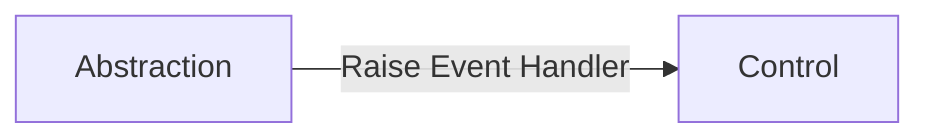

# Abstraction Layer
The abstraction layer is responsible for abstracting away the implementation of technology to services and external business processes that are consumed and used by the controller. 

## Core Activities
This includes the following core activities.
- Technology specific implementation of services and business functionality presented to the controller. 
- Transformation of data to and from application models from technology specific data models.
- Transformation of external exceptions into managed exceptions that can be raised to the controller.
- Event management for long running processes that use event notification when data is received. 

# Load Behavior
The abstraction is loaded via dependency injection. Abstractions are always instance based and are registered as transient with dependency injection. 

## Dependency Injection
Any external functionality that is needed on the abstraction is injected through constructor-based injection. The following items are generally injected into a controller. 
- Logger
- Instances of Technology Specific Functionality

## Abstraction Initialization
Abstractions are initialized through the constructor of the abstraction class. 
- Subscription to an event's from injected functionality. 
- Passing in of configuration information to execute functionality. 
- Custom logic that needs to be run when the abstract is loaded.
 

# Communications
The abstraction layer communicates with the controller layer. 

### Abstraction to Controller Communications.
The abstraction at times will need to notify the controller of an event that has occurred or trigger and agreed upon action. This is accomplished by raising an event that is subscribed to by the controller.

# Event Management
The abstraction is responsible for handling any events that it has subscribed to. Generally, with an abstraction it will only subscribe to events on items consumed through dependency injection.

# Abstraction Disposal 
The abstraction is expected to implement the **IDisposable** interface. The abstraction is responsible for the cleanup of its functionality. The following are common cleanup tasks for an abstraction.
- Unsubscribe to events.
- Call Dispose on injected functionality that support IDisposable. 

[Back to PCA Pattern](/Docs/Blazor/pcapattern.md)

