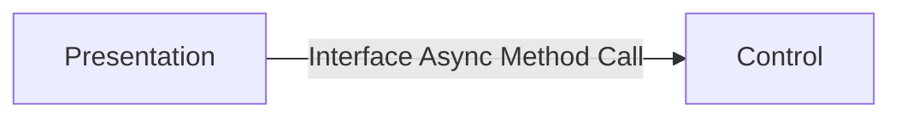
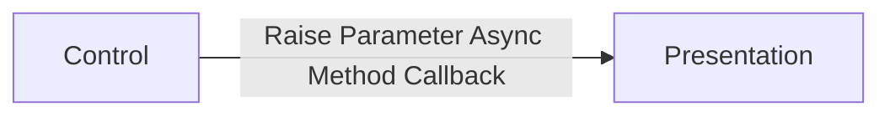
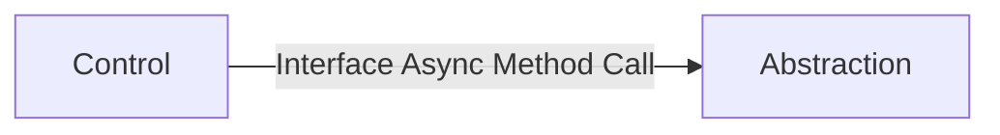
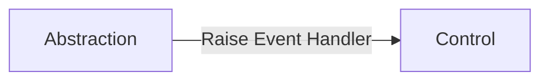

# Control Layer
The control layer is responsible for the flow and control of the functionality of a target Blazor component that it manages. 

## Core Activities
This includes the following core activities.
- Processes requests for functionality needed on the presentation. 
- Transformation of data to and from application models to view models.
- Executes abstraction calls when needed to handle presentation needs.
- Handles navigation to other parts of the system. 
- Handles events from the abstraction layer

# Load Behavior
The controller is directly loaded from the Blazor framework as a component. This will generally be in the form of a razor syntax adding the component on a target presentation component. 

## Dependency Injection
Any external functionality that is needed on the controller is injected using the razor syntax inject statement. Functionality is mapped to a property on the controller. The following items are generally injected into a controller. 
- Logger
- Abstractions used by the controller

## Controller Initialization
Controllers are initialized after the first time they are rendered. Initialization includes the following. 
- Subscription to an event's from abstractions. 
- Reading in any session specific information needed by the controller. 
- Custom logic that needs to be run when the controller starts.
 

# Communications
The controller layer communicates with the presentation and the abstraction layers. 

## Communications Between the Controller and Presentation
The presentation and controller implementations two one-way patterns to communicate between each other. The communications are based on the presentation consuming two different resources on the controller.
- Controller Interface - The controller component always implements a target interface. The interface contains methods that can be called by the presentation to perform agreed upon operations needed by the presentation.  
- Parameters - Controller parameters are always method call backs. Each method call base is used for the presentation to perform a target action agreed by the controller and the presentation.  

### Presentation to Controller Communications.
When the presentation needs data or actions to occur it calls the controller to perform the target needed functionality. This is done by calling a target method defined in the interface assigned to the controller component implementation. 

### Controller to Presentation Communications.
The controller at times will need to notify the presentation of an event that has occurred or trigger and agreed upon action. This is accomplished by executing a parameter that has been subscribed to by the presentation. 

## Communications Between the Controller and Abstraction
The controller to abstraction implements two one-way patterns to communicate between each other. The communications are based on the controller consuming an interface definition from the abstraction. 

### Controller to Abstraction Communications.
When the controller needs data or actions to occur it calls the abstraction to perform the target needed functionality. This is done by calling a target method defined in the interface assigned to the abstraction implementation. 

### Abstraction to Controller Communications.
The abstraction at times will need to notify the controller of an event that has occurred or trigger and agreed upon action. This is accomplished by raising an event that is subscribed to by the controller.

# Event Management
The controller is responsible for handling any events that it has subscribed to. Generally, with a controller it will only subscribe to events on items consumed through dependency injection. The most common event subscription is when abstractions require notification to the controller when data has returned in a subscription style pattern. 

# Controller Disposal 
The controller is expected to implement the **IDisposable** interface. The controller is responsible for the cleanup of its functionality. The following are common cleanup tasks for a controller.
- Unsubscribe to events.
- Call Dispose on injected functionality that support IDisposable.

[Back to PCA Pattern](/Docs/Blazor/pcapattern.md)

