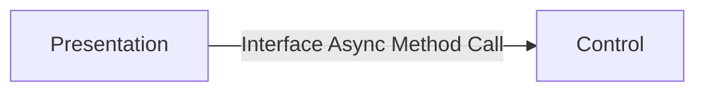
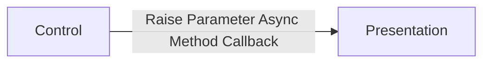

# Presentation Layer
The presentation layer is responsible for formatting and displaying the web elements in the browser. 

## Core Activities
This includes the following core activities.
- Layout of the user interface elements that are rendered in the browser.
- Handling of direct events that occur on html elements
- Manage of all data that is used in the rendering in the browser.
- Subscribing to the control layers controller.
- Calls functionality hosted on the controller.
- Handles callbacks from the controller that are registered as parameters on the controller. 

# Load Behavior
The presentation is directly loaded from the Blazor framework as a component. This will generally be in the form of a page being rendered, or as a child component of a page. 

## Blazor Components 
The presentation layer will consume additional components that it will use to build up the presentation of the screen itself. 

## Controller Component
The presentation will subscribe to a single controller component. The controller component is directly referenced in the markup of the presentation. 

The following are additional criteria when setting up the controller. 
- The **ref** is always set to a target private property on presentations code behind set to an interface that is implemented in the controller. General guidance is the controller property will always be named **Controller**.
- A controller will have parameters if it needs to call back into the presentation to perform an agreed upon action. The parameters will always be in the form of a method call back. If the controller has parameters then the presentation create private methods to handle the call backs from the controller. The callbacks are always registered in the markup of the controller on the presentation. 

# Communications
The presentation layer communicates with only two types of external objects. Both object types are native Blazor components. 

## Communications Between the Presentation and Controller
The presentation and controller implementations two one-way patterns to communicate between each other. The communications are based on the presentation consuming two different resources on the controller.
- Controller Interface - The controller component always implements a target interface. The interface contains methods that can be called by the presentation to perform agreed upon operations needed by the presentation.  
- Parameters - Controller parameters are always method call backs. Each method call base is used for the presentation to perform a target action agreed by the controller and the presentation.  

### Presentation to Controller Communications.
When the presentation needs data or actions to occur it calls the controller to perform the target needed functionality. This is done by calling a target method defined in the interface assigned to the controller component implementation. 

### Controller to Presentation Communications.
The controller at times will need to notify the presentation of an event that has occurred or trigger and agreed upon action. This is accomplished by executing a parameter that has been subscribed to by the presentation. 

# Data Management
During the executions of the PCA functionality the data that is used is stored either on the presentation itself or managed from the controller using data binding. Both approaches can be used with data management. 

## Instance data
The data that is used in the execution of the presentation is always stored as private scoped properties on the presentation. 

## Session data 
If data needs to be persisted beyond the life of a single usage of the presentation, then the data will be stored using data classes that are loaded using dependency injection. The lifetime of the data classes from dependency injection will be based on if its static information or data that needs to live for the life of the session. For data that is static in nature will be registered as singleton. For session-based data then it will register as scoped.  

# Event Management
The presentation is responsible for handling all events that are from html, java script, and components subscribed to on the presentation. There should be no direct subscription to presentation events from the controller.  

[Back to PCA Pattern](/pcapattern.md)

