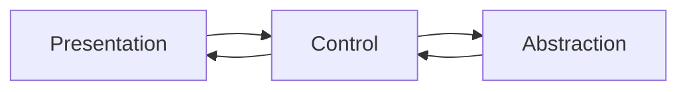

# Presentation Control Abstraction Pattern
View centric development pattern for building a Microsoft Blazor based web application that is based on a presentation-based load pattern and implementation. The pattern is broken down into three distinct layers of functionality **presentation**,**control**, and **abstraction**.  Each of the three layers focuses on a distinct part of the implementation of the Blazor functionality. 

## Layer Diagram for **PCA (Presentation Control Abstraction)**

## Goals of the PCA Pattern
- Take advantage of the component first approach of Blazor to load all the pattern functionality.
- Separation of functionality in logical groupings of functionality 
- Contract driven execution of functionality at all layers of the pattern.
- Design for isolation testing.
- Easy replacement of functionality at each contract boundary in the system without the rewrite of the other layers.

## Layer Definitions
The following will take you to the definition of each layer of the PCA pattern. 

- [Presentation Layer](/Docs/Presentation-Layer.md)
- [Control Layer](/Docs/Control-Layer)
- [Abstraction Layer](/Docs/Abstraction-Layer)
